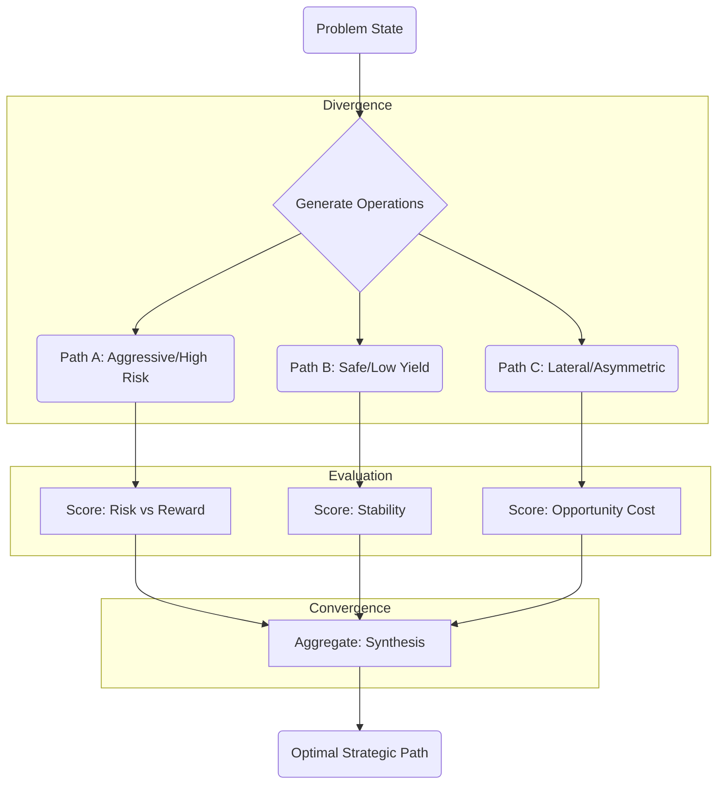

# Protocol 137: Graph of Thoughts (GoT) Logic

> **Source**: Adapted from ETH Zurich SPCL Graph-of-Thoughts ([arXiv:2308.09687](https://arxiv.org/abs/2308.09687), 2023)
> **Domain**: Decision / High-Lakes Reasoning
> **Priority**: ⭐⭐⭐ Critical (L4 Engine)
> **Related**: [Protocol 123 (Einstein)](../decision/123-einstein-protocol.md), [Protocol 75 (Synthetic Parallel Reasoning)](examples/protocols/decision/75-synthetic-parallel-reasoning.md)

---

## Core Principle

> **"Reasoning is not a Line. It is a Network."**

Standard LLM reasoning (Chain of Thought) is linear: `A -> B -> C`.
**Graph of Thoughts (GoT)** is topological: `A -> (B1, B2, B3) -> Score -> Convergence -> C`.

It models human "brainstorming" where multiple possibilities are explored, critiqued, and synthesized before a final conclusion is reached.

---

## The GoT Topology

When executing **Phase 2 (Solution)** of the [Einstein Protocol](../decision/123-einstein-protocol.md), use this flow:

---

## Operations Manual

### 1. `Generate` (Divergence)

**Command**: "Generate 3 distinct approaches to this problem. Do not evaluate yet. Just generate."

* **Mode 1**: Direct Attack (Logic)
* **Mode 2**: Flanking Maneuver (Social/Psychological)
* **Mode 3**: Inversion (What if we do nothing?)

### 2. `Score` (Critique)

**Command**: "Critique each path. Assign a 0-10 score based on [Survivability] and [Upside]."

* Apply **The Right of Way Fallacy**: Does this path rely on being "Right" or being "Alive"?
* Apply **Law #1**: Does this path risk Ruin? (If yes, Score = 0).

### 3. `Aggregate` (Convergence)

**Command**: "Synthesize the best elements of the top paths. Discard the weak elements."

* Don't just pick one. **Merge them**.
* *Example*: "Take the Aggression of Path A but buffer it with the Safety Protocols of Path B."

---

## Integration with Athena

This protocol is the **Engine** for:

1. **`/ultrathink`**: Automatically activates GoT topology.
2. **Complex Social Dynamics**: Used to map "Move vs Counter-Move" (Game Theory).
3. **Code Architecture**: Used to evaluate "Quick Fix" vs "Refactor".

---

## Tags

# protocol #decision #got #reasoning #topology #graph-of-thoughts
